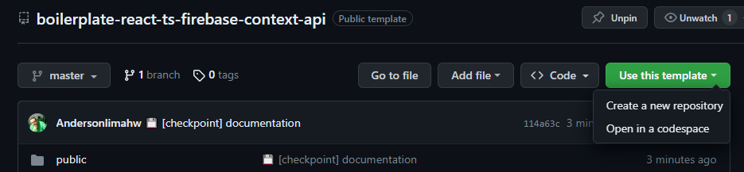
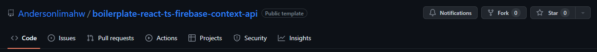
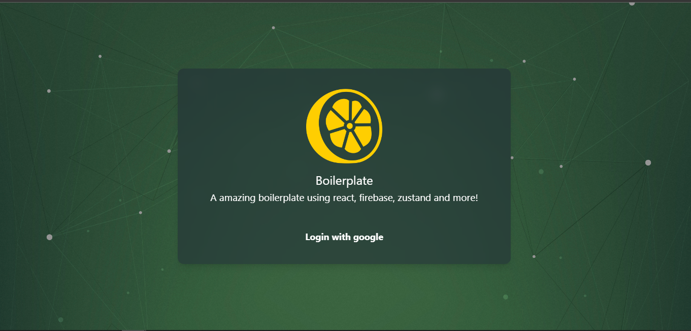

<h1 align="center">Welcome to amazing react boilerplate 👋</h1>
<p>
  

  <a href="#" target="_blank">
    
  </a>

  <a href="https://twitter.com/anderson.lima.dev" target="_blank">
    
  </a>

  <br />
  
 
 
 


> Boilerplate : PWA project using vite, react, zustand, tailwindcss vitest and more!


### ✨ [Demo](https://lemon-firebase-chat-sample.vercel.app)

Look a project using this boilerplate

## Using

Use has template




Or fork:



Customize pages how you need!

## ✨ Features ✨:

* Created using vite a very fast front-end tooling 

* Toasts with  react-tostify

* zustand for state management

* Base service to manage your requests
* Mocks with miragejs
* Vitest for unit tests and code coverage collect


## Boilerplates
Boilerplates are pre-made templates or frameworks that contain a foundational structure, configurations, and often basic functionalities for a particular type of project. They're designed to help kick-start development by providing a starting point, allowing developers to avoid repetitive setup tasks and focus on building specific features.

You can get more boilerplates in this github profile:
[click here for more boilerplates 👩🏾‍🎤](https://github.com/Andersonlimahw?tab=repositories&q=boiler&type=&language=&sort=)

## Install

```sh
npm install
```

## Run

```sh
npm run dev

```

Open link in your favorite your browser:
[http://localhost:5173](http://localhost:5173/)




## Run tests

```sh
npm run test
```

## Technologies and strategies:
[vite](https://vitejs.dev/) <br />
[pwa](https://developer.mozilla.org/en-US/docs/Web/Progressive_web_apps) <br />
[react](https://react.dev/learn) <br />
[zustand](https://github.com/pmndrs/zustand) <br />
[typescript](https://www.typescriptlang.org/docs/) <br />
[firebase](https://firebase.google.com/docs) <br />
[vitest](https://vitest.dev/) <br />
[tailwindcss](https://tailwindcss.com/docs/animation) <br />
[miragejs](https://miragejs.com/)<br />

## Author

👤 **Anderson Lima (Lemon 🍋)**

- Website: https://lemondev.dev.br
- Twitter: [@andersonlimahw](https://twitter.com/andersonlimahw)
- Github: [@andersonlimahw](https://github.com/andersonlimahw)
- LinkedIn: [@andersonlimahw](https://linkedin.com/in/andersonlimahw)

## ⭐ Show your support
give a ⭐ if this project helped you!
